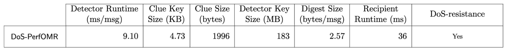

# DoS-resistant Oblivious Message Retrieval from Snake-eye Resistant PKE


### Abstract:

Oblivious message retrieval (OMR) allows messages resource-limited recipients to outsource the message retrieval process without revealing which messages are pertinent to which recipient. Its realizations in recent works leave an open problem: can an OMR scheme be both practical and provably secure against spamming attacks from malicious senders (i.e., DoS-resistant) under standard assumptions?  

In this work, we first prove that a prior construction OMRp2 is DoS-resistant under a standard LWE assumption, resolving an open conjecture of prior works. Then, we present DoS-PerfOMR: a provably DoS-resistant OMR construction that is 12x faster than OMRp2, and (almost) matches the performance of the state-of-the-art OMR scheme that is not DoS-resistant.

As a building block, we analyze the snake-eye resistance property for general PKE schemes. We construct a new lattice-based PKE scheme, LWEmongrass that is provably snake-eye resistant and has better efficiency than the PVW scheme underlying OMRp2. We also show that the natural candidates (e.g., RingLWE PKE) are not snake-eye resistant. Of independent interest, we introduce two variants of LWE with side information, as components towards proving the properties of LWEmongrass, and reduce standard LWE to them for the parameters of interest.


## What's in the demo


### DoS-PerfOMR: DoS-resistance OMR
- Obliviously identify the pertinent messages and pack all their contents into a into a single digest.
- Schemes benchmarked (in DoS PerfOMR): 
    - main scheme DoS-PerfOMR (Section 7.4)
- Parameters: N = 2^19 (or *N* = 500,000 padded to 2^19), k = *ḱ* = 50. Benchmark results on a Google Compute Cloud e2-standard-8 instance type (8 hyperthreads of an Intel Xeon 3.10 GHz CPU with 32GB RAM) are reported in Section 8 in DoS-PerfOMR paper
- Measurement (with parameters in Section 8):
    - 


## Dependencies

The dos-PerfOMR library relies on the following:

- C++ build environment
- CMake build infrastructure
- [SEAL](https://github.com/microsoft/SEAL) library 4.1 and all its dependencies \
  Notice that we made some manual change on SEAL interfaces to facilitate our implementation and thus a built-in dependency of SEAL is directly included under 'build' directory.
- [PALISADE](https://gitlab.com/palisade/palisade-release) library release v1.11.2 and all its dependencies,\
  as v1.11.2 is not publicly available anymore when this repository is made public, we use v1.11.3 in the instructions instead.
- [NTL](https://libntl.org/) library 11.4.3 and all its dependencies
- [OpenSSL](https://github.com/openssl/openssl) library on branch OpenSSL_1_1_1-stable \
   We use an old version of OpenSSL library for plain AES function without the complex EVP abstraction.
- (Optional) [HEXL](https://github.com/intel/hexl) library 1.2.3

### Scripts to install the dependencies and build the binary
Notice that the following instructions are based on installation steps on a Ubuntu 20.04 LTS.
```
# If permission required, please add sudo before the commands as needed

sudo apt-get update && sudo apt-get install build-essential # if needed
sudo apt-get install autoconf # if no autoconf
sudo apt-get install cmake # if no cmake
sudo apt-get install libgmp3-dev # if no gmp
sudo apt-get install libntl-dev=11.4.3-1build1 # if no ntl
sudo apt-get install unzip # if no unzip

# If you have the DOS_code.zip directly, put it under ~/OMR and unzip it into ObliviousMessageRetrieval dir, otherwise:
gh repo clone ObliviousMessageRetrieval/ObliviousMessageRetrieval

 # change build_path to where you want the dependency libraries installed
OMRDIR=~/OMR  
BUILDDIR=$OMRDIR/ObliviousMessageRetrieval/build

cd $OMRDIR && git clone -b v1.11.3 https://gitlab.com/palisade/palisade-release
cd palisade-release
mkdir build
cd build
cmake .. -DCMAKE_INSTALL_PREFIX=$BUILDDIR
make
make install

# Old OpenSSL used for plain AES function without EVP abstraction
cd $OMRDIR && git clone -b OpenSSL_1_1_1-stable https://github.com/openssl/openssl
cd openssl
./config --prefix=$BUILDDIR
make
make install

# Optional
# Notice that although we 'enable' hexl via command line, it does not take much real effect on GCP instances
# and thus does not have much impact on our runtime
cd $OMRDIR && git clone --branch 1.2.3 https://github.com/intel/hexl
cd hexl
cmake -S . -B build -DCMAKE_INSTALL_PREFIX=$BUILDDIR
cmake --build build
cmake --install build

cd $OMRDIR/ObliviousMessageRetrieval/build
mkdir ../data
mkdir ../data/payloads
mkdir ../data/clues
cmake .. -DCMAKE_PREFIX_PATH=$BUILDDIR
make
```

### To Run

```
cd $BUILDDIR
# to run our main DoS-PerfOMR construction: for example: ./OMRdemos dos 1 2 32768 50
./OMRdemos dos <number_of_cores> <number_of_messages_in_bundle> <number_of_bundles> <number_of_pert_msgs>


# to reproduce the main benchmark result:
./OMRdemos dos 1 8 65536 50 
```

### Sample Output
```
Preparing database and paramaters...
Pertient message indices: [ 3558 3683 3881 4099 4857 5142 5241 7165 7774 7806 8085 8375 8381 8597 8608 8769 9119 9960 10478 10689 10928 12291 12937 13238 15021 16730 16929 19011 19745 20384 21812 22398 22565 23523 23913 24844 24929 25352 25687 26401 27076 27309 27372 28726 30793 31006 31344 31838 32077 32215 ]
/
| Encryption parameters :
|   scheme: BFV
|   poly_modulus_degree: 32768
|   coeff_modulus size: 905 (35 + 60 + 60 + 60 + 60 + 60 + 60 + 60 + 60 + 60 + 60 + 60 + 60 + 60 + 30 + 60) bits
|   plain_modulus: 65537
\
Database and parameters prepared.

Preprocess switching key time: 264900272 us.
ClueToPackedPV time: 160386979 us.
PVUnpack time: 675661388 us.
ExpandedPVToDigest time: 218222953 us.

Detector running time: 965717410 us.
Digest size: 568138 bytes
