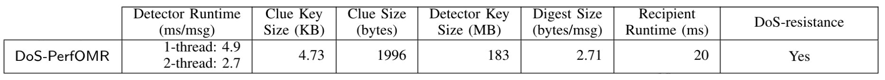

# DoS-resistant Oblivious Message Retrieval from Snake-eye Resistant PKE


### Abstract:

Oblivious message retrieval (OMR) allows messages resource-limited recipients to outsource the message retrieval process without revealing which messages are pertinent to which recipient.
Its realizations in recent works leave an open problem:
can an OMR scheme be both practical and provably secure against spamming attacks from malicious senders (i.e., DoS-resistant) under standard assumptions?
    
We present PerfOMR: a provably DoS-resistant OMR construction that is 12x faster than OMRp2 (a conjectured DoS-resistant OMR construction in prior works), and (almost) matches the performance of the state-of-the-art OMR scheme that is _not_ DoS-resistant (proven by the attacks we show)\thomas{Added the last sentence.

As a building block, we analyze the \textit{snake-eye resistance} property for general PKE schemes.
We construct a new lattice-based PKE scheme, LWEmongrass that is provably snake-eye resistant and has better efficiency than the PVW scheme underlying OMRp2.
We also show that the natural candidates (e.g., RingLWE PKE) are not snake-eye resistant.


## What's in the demo


### DoS-PerfOMR: DoS-resistance OMR
- Obliviously identify the pertinent messages and pack all their contents into a into a single digest.
- Schemes benchmarked (in DoS PerfOMR): 
    - main scheme DoS-PerfOMR (Section 8.3)
- Parameters: N = 2^19 (or *N* = 500,000 padded to 2^19), $m = \bar{m}$ = 50. Benchmark results on a Google Compute Cloud n4-standard-8 instance type with 32GB RAM are reported in Section 9 in our paper
- Measurement (with parameters in Section 9):


## Dependencies

The dos-PerfOMR library relies on the following:

- C++ build environment
- CMake build infrastructure
- [SEAL](https://github.com/wyunhao/SEAL) library 4.1 and all its dependencies \
  Notice that we rely on a separate fork of the [original SEAL](https://github.com/microsoft/SEAL) library, which makes some manual change on SEAL interfaces. This fork is used by prior works like [PerfOMR](https://eprint.iacr.org/2024/204), and since our implementation is based on PerfOMR's implementation, we also use this fork of library.
- [PALISADE](https://gitlab.com/palisade/palisade-release) library release v1.11.2 and all its dependencies,\
  as v1.11.2 is not publicly available anymore when this repository is made public, we use v1.11.3 in the instructions instead.
- [NTL](https://libntl.org/) library 11.4.3 and all its dependencies
- [OpenSSL](https://github.com/openssl/openssl) library on branch OpenSSL_1_1_1-stable \
   We use an old version of OpenSSL library for plain AES function without the complex EVP abstraction.
- (Optional) [HEXL](https://github.com/intel/hexl) library 1.2.3 (this would accelerate the SEAL operations with an Intel AVX-512 processor)

### Scripts to install the dependencies and build the binary
Notice that the following instructions are based on installation steps on a Ubuntu 20.04 LTS.
```
# If permission required, please add sudo before the commands as needed

sudo apt-get update && sudo apt-get install build-essential # if needed
sudo apt-get install autoconf # if no autoconf
sudo apt-get install cmake # if no cmake
sudo apt-get install libgmp3-dev # if no gmp
sudo apt-get install libntl-dev=11.4.3-1build1 # if no ntl
sudo apt-get install unzip # if no unzip

# If you have the DOS_code.zip directly, put it under ~/OMR and unzip it into ObliviousMessageRetrieval dir, otherwise:
gh repo clone ObliviousMessageRetrieval/ObliviousMessageRetrieval

 # change build_path to where you want the dependency libraries installed
OMRDIR=~/OMR  
BUILDDIR=$OMRDIR/ObliviousMessageRetrieval/build

cd $OMRDIR && git clone -b v1.11.3 https://gitlab.com/palisade/palisade-release
cd palisade-release
mkdir build
cd build
cmake .. -DCMAKE_INSTALL_PREFIX=$BUILDDIR
make
make install

# Old OpenSSL used for plain AES function without EVP abstraction
cd $OMRDIR && git clone -b OpenSSL_1_1_1-stable https://github.com/openssl/openssl
cd openssl
./config --prefix=$BUILDDIR
make
make install

# a separate fork of SEAL library that overwrite some private functions, used in prior works
# we also depend on this library which is used by the prior work we are based on
cd $OMRDIR && git clone https://github.com/wyunhao/SEAL
cd SEAL
cmake -S . -B build -DCMAKE_INSTALL_PREFIX=$BUILDDIR -DSEAL_USE_INTEL_HEXL=ON 
cmake --build build
cmake --install build

# Optional
# Notice that although we 'enable' hexl via command line, it does not take much real effect on GCP instances
# and thus does not have much impact on our runtime
cd $OMRDIR && git clone --branch 1.2.3 https://github.com/intel/hexl
cd hexl
cmake -S . -B build -DCMAKE_INSTALL_PREFIX=$BUILDDIR
cmake --build build
cmake --install build

cd $OMRDIR/ObliviousMessageRetrieval/build
mkdir ../data
mkdir ../data/payloads
mkdir ../data/clues
cmake .. -DCMAKE_PREFIX_PATH=$BUILDDIR
make
```

### To Run

```
cd $BUILDDIR
# to run our main DoS-PerfOMR construction: for example: ./OMRdemos dos 1 2 32768 50
./OMRdemos dos <number_of_cores> <number_of_messages_in_bundle> <number_of_bundles> <number_of_pert_msgs>


# to reproduce the main benchmark result in Table 1 of our submission:
./OMRdemos dos 1 8 65536 50
./OMRdemos dos 2 8 65536 50

# to reproduce the main benchmark result in Table 2 of our submission:
./OMRdemos dos 1 8 65536 50
./OMRdemos dos 1 8 65536 100
./OMRdemos dos 1 8 65536 150
./OMRdemos dos 1 8 65536 50
./OMRdemos dos 1 8 262144 50
./OMRdemos dos 1 8 1048576 50

# to reproduce the attack described in section 6.1 in our submission:
# notice that this is automatically run for three times to make sure that the attack works
# in our submission, we report that the attack succeeded in all ten trials
# this can be easily tested by re-run this command multiple times
./OMRdemos dos-attack
```

### Sample Output for Normal Benchmark
```
Preparing database and paramaters...
Pertient message indices: [ 3558 3683 3881 4099 4857 5142 5241 7165 7774 7806 8085 8375 8381 8597 8608 8769 9119 9960 10478 10689 10928 12291 12937 13238 15021 16730 16929 19011 19745 20384 21812 22398 22565 23523 23913 24844 24929 25352 25687 26401 27076 27309 27372 28726 30793 31006 31344 31838 32077 32215 ]
/
| Encryption parameters :
|   scheme: BFV
|   poly_modulus_degree: 32768
|   coeff_modulus size: 905 (35 + 60 + 60 + 60 + 60 + 60 + 60 + 60 + 60 + 60 + 60 + 60 + 60 + 60 + 30 + 60) bits
|   plain_modulus: 65537
\
Database and parameters prepared.

Preprocess switching key time: 251541219 us.
ClueToPackedPV time: 1669926636 us.
PVUnpack time: 309490659 us.
ExpandedPVToDigest time: 314739741 us.

Detector running time: 2597531678 us.
Digest size: 1419844 bytes

Result is correct!
```

### Sample Output for DoS Attack
```
Preparing database and paramaters...
Pertient message indices: [ 886 2272 2776 4244 5973 6603 6885 8562 8898 9377 10141 10374 10790 11101 12852 12992 13043 13077 13549 14793 15298 15729 16491 17013 17440 17524
 19248 19846 20897 21296 23299 23315 24994 25479 25937 27166 27182 27680 28007 28128 28631 29243 29683 29992 30497 30706 30895 31867 32402 ]

DoS attack on index zero.
Pertient message indices with attack: [ 886 2272 2776 4244 5973 6603 6885 8562 8898 9377 10141 10374 10790 11101 12852 12992 13043 13077 13549 1479
3 15298 15729 16491 17013 17440 17524 19248 19846 20897 21296 23299 23315 24994 25479 25937 27166 27182 27680 28007 28128 28631 29243 29683 29992 30497 30706 30895 31867 32
402 ]
/
| Encryption parameters :
|   scheme: BFV
|   poly_modulus_degree: 32768
|   coeff_modulus size: 917 (60 + 55 + 60 + 60 + 60 + 60 + 60 + 60 + 60 + 60 + 60 + 60 + 60 + 60 + 22 + 60) bits
|   plain_modulus: 65537
\
Database and parameters prepared.

Detected message indices on user side: 0  886  2272  2776  4244  5973  6603  6885  8562  8898  9377  10141  10374  10790  11101  12852  12992  13043  13077  13549  14793  1
5298  15729  16491  17013  17440  17524  19248  19846  20897  21296  23299  23315  24994  25479  25937  27166  27182  27680  28007  28128  28631  29243  29683  29992  30497
  30706  30895  31867  32402

Result is correct!
```
