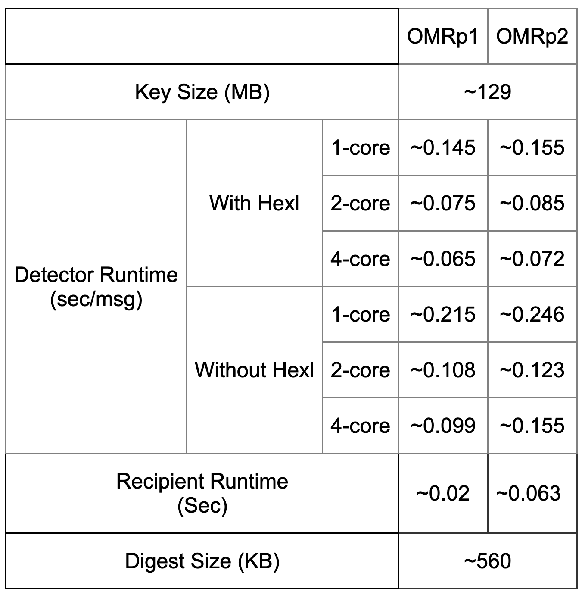
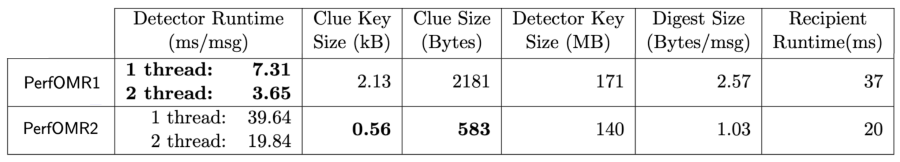
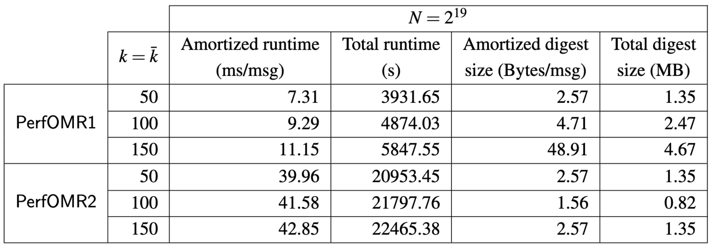
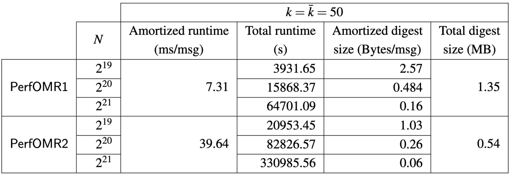

# DoS-resistant Oblivious Message Retrieval from Snake-eye Resistant PKE


### Abstract:

Oblivious message retrieval (OMR) allows messages resource-limited recipients to outsource the message retrieval process without revealing which messages are pertinent to which recipient. Its realizations in recent works leave an open problem: can an OMR scheme be both practical and provably secure against spamming attacks from malicious senders (i.e., DoS-resistant) under standard assumptions?  

In this work, we first prove that a prior construction OMRp2 is DoS-resistant under a standard LWE assumption, resolving an open conjecture of prior works. Then, we present DoS-PerfOMR: a provably DoS-resistant OMR construction that is 12x faster than OMRp2, and (almost) matches the performance of the state-of-the-art OMR scheme that is not DoS-resistant.

As a building block, we analyze the snake-eye resistance property for general PKE schemes. We construct a new lattice-based PKE scheme, LWEmongrass that is provably snake-eye resistant and has better efficiency than the PVW scheme underlying OMRp2. We also show that the natural candidates (e.g., RingLWE PKE) are not snake-eye resistant. Of independent interest, we introduce two variants of LWE with side information, as components towards proving the properties of LWEmongrass, and reduce standard LWE to them for the parameters of interest.


## License
The OMR library is developed by [Zeyu (Thomas) Liu](https://zeyuthomasliu.github.io/), [Eran Tromer](https://www.tau.ac.il/~tromer/) and [Yunhao Wang](https://wyunhao.github.io/), and is released under the MIT License (see the LICENSE file).


## Model Overview

The following diagram demonstrates the main components of OMR:


Here, we also briefly summarize the high-level scheme notions as below.
In our system, we have a bulletin board (or board), denoted *BB*, that is publicly available contatining *N* messages. Each message is sent from some sender and is addressed to some recipient(s), whose identities are supposed to remain private.

A message consists of a pair (*xi*, *ci*) where *xi* is the message payload to convey, and *ci* is a clue string which helps notify the intended recipient (and only them) that the message is addressed to them.

To generate the clue, the sender grabs the target recipient's *clue key*.

At any time, any potential recipient *p* may want to retrieve the messages in *BB* that are addressed to them. We call these messages pertinent (to *p*), and the rest are impertinent.

A server, called a detector, helps the recipient *p* detect which message indices in *BB* are pertinent to them, or retrieve the payloads of the pertinent messages. This is done obliviously: even a malicious detector learns nothing about which messages are pertinent. The recipient gives the detector their detection key and a bound *ḱ* on the number of pertinent messages they expect to receive. The detector then accumulates all of the pertinent messages in *BB* into string *M*, called the digest, and sends it to the recipient *p*.

The recipient *p* processes *M* to recover all of the pertinent messages with high probability, assuming a semi-honest detector and that the number of pertinent messages did not exceed *ḱ*.

In the [OMR](https://eprint.iacr.org/2021/1256.pdf) papr, a Regev05 ciphertext is used as the clue, included in each message, to indicate pertinency:
if the ciphertext decrypts to 0 using a recipient's secret key,
this recipient deems the corresponding message as pertinent.
Thus, the original [OMR](https://eprint.iacr.org/2021/1256.pdf) paper proposes the *Snake-Eye Conjecture*:
any non-trivial Regev05 ciphertext cannot be decrypted to zero under two different secret keys (except with a trivial probability).
Under this conjecture,
the authors prove that such a spamming attack under the DoS model does not work,
and refer to this property as DoS-resistance. Formal definition can be founded in Section 7.1 in DoS-PerfOMR paper.

To formally prove this conjecture and construct a DoS-resistant OMR, we introduce two new LWE variants: *LWE with Correlation* and *LWE with Random Hints*. We refer readers who are interested in the technical details to our DoS-PerfOMR paper.

This code implements DoS-PerfOMR scheme (in Section 7.4 in the DoS-PerfOMR paper, which is based on the OMR described in the [OMR paper](https://eprint.iacr.org/2021/1256.pdf).


## What's in the demo

### Oblivious Message Retrieval
- Obliviously identify the pertinent messages and pack all their contents into a into a single digest.
- Schemes benchmarked: OMR1p (Section 7.4) and OMR2p (Section 7.5) in [OMR](https://eprint.iacr.org/2021/1256.pdf)
- Parameters: N = 2^19 (or *N* = 500,000 padded to 2^19), k = *ḱ* = 50, run on a Google Compute Cloud c2-standard-4instance type (4 hyperthreads of an Intel Xeon 3.10 GHz CPU with 16GB RAM)
- Measurement: 
  - 


### PerfOMR: OMR with Reduced Communication and Computation
- Obliviously identify the pertinent messages and pack all their contents into a into a single digest.
- Schemes benchmarked (in PerfOMR): 
    - main scheme PerfOMR1 (Section 5.3)
    - alternative scheme PerfOMR2 (Section 6)
- Parameters: N = 2^19, 2^20, 2^21, k = *ḱ* = 50, 100, 150, run on a a Google Compute Cloud c2-standard-4instance type (4 hyperthreads of an Intel Xeon 3.10 GHz CPU with 16GB RAM)
- Measurement (with parameters in Section 7):
    - 
    - Detector run time scaling:
        - runtime vs. *ḱ* 
        - runtime vs. *N* 


### DoS-PerfOMR: DoS-resistance OMR
- Obliviously identify the pertinent messages and pack all their contents into a into a single digest.
- Schemes benchmarked (in DoS PerfOMR): 
    - main scheme DoS-PerfOMR (Section 7.4)
- Parameters: N = 2^19, k = *ḱ* = 50, run on a a Google Compute Cloud e2-standard-8 instance type (4 hyperthreads of an Intel Xeon 3.10 GHz CPU with 32GB RAM)
- Measurement (with parameters in Section 8):
    - 


### Parameters Summary
- OMR: N = 2^19 (or *N* = 500,000 padded to 2^19), k = *ḱ* = 50. Benchmark results on a Google Compute Cloud c2-standard-4instance type (4 hyperthreads of an Intel Xeon 3.10 GHz CPU with 16GB RAM) are reported in Section 10 in [OMR paper](https://eprint.iacr.org/2021/1256.pdf).

- PerfOMR: N = 2^19, 2^20, 2^21, k = *ḱ* = 50, 100, 150. Benchmark results on a Google Compute Cloud c2-standard-4instance type (4 hyperthreads of an Intel Xeon 3.10 GHz CPU with 16GB RAM) are reported in Section 7 in the submitted [PerfOMR paper](https://eprint.iacr.org/2024/204.pdf).

- DoS-PerfOMR: N = 2^19 (or *N* = 500,000 padded to 2^19), k = *ḱ* = 50. Benchmark results on a Google Compute Cloud e2-standard-8 instance type (8 hyperthreads of an Intel Xeon 3.10 GHz CPU with 32GB RAM) are reported in Section 8 in DoS-PerfOMR paper.


## Dependencies

The OMR library relies on the following:

- C++ build environment
- CMake build infrastructure
- [SEAL](https://github.com/microsoft/SEAL) library 4.1 and all its dependencies \
  Notice that we made some manual change on SEAL interfaces to facilitate our implementation and thus a built-in dependency of SEAL is directly included under 'build' directory.
- [PALISADE](https://gitlab.com/palisade/palisade-release) library release v1.11.2 and all its dependencies,\
  as v1.11.2 is not publicly available anymore when this repository is made public, we use v1.11.3 in the instructions instead.
- [NTL](https://libntl.org/) library 11.4.3 and all its dependencies
- [OpenSSL](https://github.com/openssl/openssl) library on branch OpenSSL_1_1_1-stable \
   We use an old version of OpenSSL library for plain AES function without the complex EVP abstraction.
- (Optional) [HEXL](https://github.com/intel/hexl) library 1.2.3

### Scripts to install the dependencies and build the binary
Notice that the following instructions are based on installation steps on a Ubuntu 20.04 LTS.
```
# If permission required, please add sudo before the commands as needed

sudo apt-get update && sudo apt-get install build-essential # if needed
sudo apt-get install autoconf # if no autoconf
sudo apt-get install cmake # if no cmake
sudo apt-get install libgmp3-dev # if no gmp
sudo apt-get install libntl-dev=11.4.3-1build1 # if no ntl
sudo apt-get install unzip # if no unzip

# If you have the DOS_code.zip directly, put it under ~/OMR and unzip it into ObliviousMessageRetrieval dir, otherwise:
gh repo clone ObliviousMessageRetrieval/ObliviousMessageRetrieval

 # change build_path to where you want the dependency libraries installed
OMRDIR=~/OMR  
BUILDDIR=$OMRDIR/ObliviousMessageRetrieval/build

cd $OMRDIR && git clone -b v1.11.3 https://gitlab.com/palisade/palisade-release
cd palisade-release
mkdir build
cd build
cmake .. -DCMAKE_INSTALL_PREFIX=$BUILDDIR
make
make install

# Old OpenSSL used for plain AES function without EVP abstraction
cd $OMRDIR && git clone -b OpenSSL_1_1_1-stable https://github.com/openssl/openssl
cd openssl
./config --prefix=$BUILDDIR
make
make install

# Optional
# Notice that although we 'enable' hexl via command line, it does not take much real effect on GCP instances
# and thus does not have much impact on our runtime
cd $OMRDIR && git clone --branch 1.2.3 https://github.com/intel/hexl
cd hexl
cmake -S . -B build -DCMAKE_INSTALL_PREFIX=$BUILDDIR
cmake --build build
cmake --install build

cd $OMRDIR/ObliviousMessageRetrieval/build
mkdir ../data
mkdir ../data/payloads
mkdir ../data/clues
mkdir ../data/cluePoly
mkdir ../data/processedCM
cmake .. -DCMAKE_PREFIX_PATH=$BUILDDIR
make
```

### To Run

```
cd $BUILDDIR
# to run our main DoS-PerfOMR construction: for example: ./OMRdemos dos 1 2 32768 50
./OMRdemos dos <number_of_cores> <number_of_messages_in_bundle> <number_of_bundles> <number_of_pert_msgs>


# to reproduce the main benchmark result:
./OMRdemos dos 1 8 65536 50 
```
